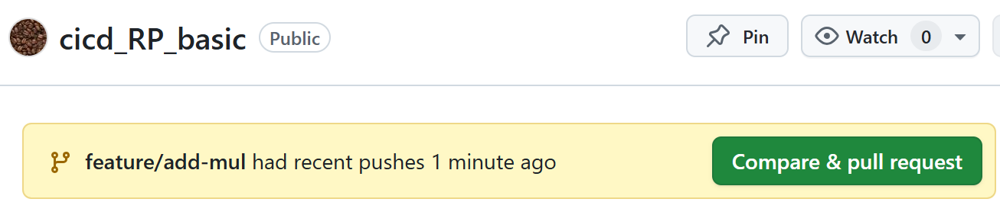
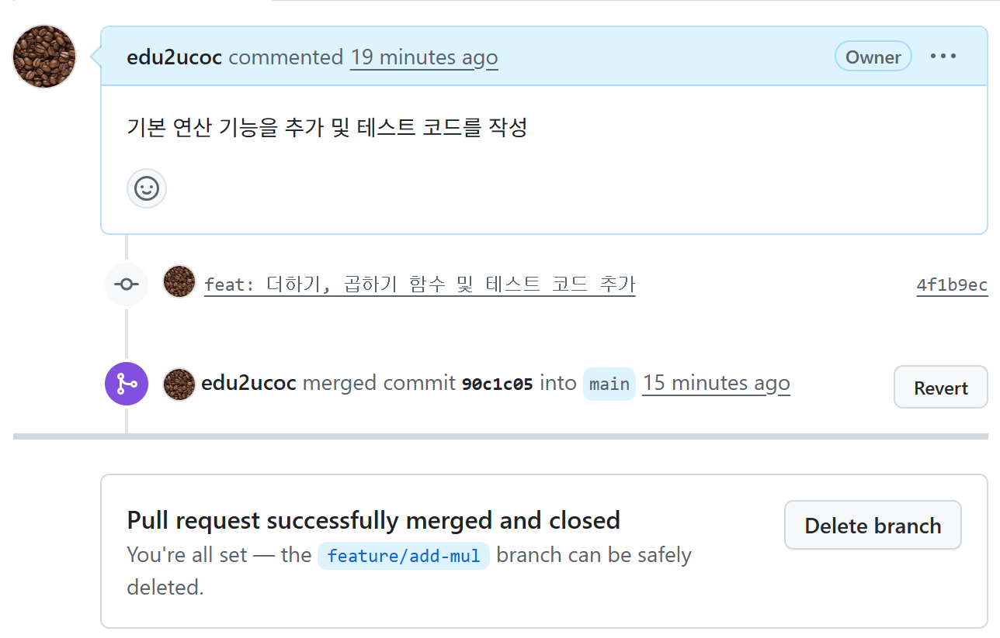

# 기본 철학
- main 브랜치는 언제나 배포 가능한 상태여야 한다

# 브랜치 전략 (Branch Strategy)
- 구성
    - 팀 규모가 작거나 빠른 배포가 목표라면 복잡한 구조 대신 아래 두 가지 브랜치만 운용
- 브런치
    - main (Master)
        역할: 실제 제품(Production)으로 나가는 코드가 모이는 곳.
        규칙: 직접 push 금지. 오직 PR(Pull Request)을 통해서만 합쳐져야 함.
        상태: 언제든지 배포해도 에러가 없는 깨끗한 상태.
    
    - feature/... (또는 주제별/...)
        역할: 새로운 기능을 개발하거나 버그를 수정하는 작업 공간.
        규칙: main에서 파생되어 나옴. 작업이 끝나면 main으로 PR을 보냄.
        작명 예시: feature/login-ui, fix/login-bug, refactor/structure

- 절차
    - 작업 및 PR 처리 절차 (Workflow)
        - 분기 -> 작업 -> 검증 -> 병합

# 실습 1 - 기본설정
- 기능 추가
    - 목표: main 브랜치를 건드리지 않고, 새로운 브랜치에서 기능을 개발하고 테스트를 통과한 뒤 병합
- 기본 세팅
    - 이제 CI 테스트(pytest)가 실패하면 main 브랜치에 합칠(Merge) 수 없게 구성
    - 절차
        - Settings -> Branches -> Add branch protection rule
        - Branch name pattern에 main 입력
        - Require status checks to pass before merging 체크.
            - 검색창에 build-and-test (우리가 작성한 yml의 job 이름)를 검색해서 선택
        - CI 테스트(pytest)가 실패하면 main 브랜치에 합칠(Merge) 수 없게 됨

# 실습 2 - 브랜치 생성 및 개발 (Local)
## 터미널 : 브랜치 최신화 -> 브랜치 생성
```
# 1. 메인 브랜치 최신화
git checkout main
git pull origin main

# 2. 작업 브랜치 생성 (이름: feature/add-mul)
git checkout -b feature/add-mul
```
## 코드 추가
```
# app.py
# test_app.py
```
## 커밋 및 푸시 (Local -> Remote)
```
# 1. 변경사항 확인
git status

# 2. 스테이징 및 커밋
git add .
git commit -m "feat: 더하기, 곱하기 함수 및 테스트 코드 추가"

# 3. 원격 저장소(GitHub)로 푸시
git push origin feature/add-mul
```
## Pull Request 생성 (GitHub Web)
- GitHub 접속
- GitHub 저장소 메인 페이지로 이동
- 노란색 박스로 "Compare & pull request" 버튼 확인
    - 클릭
    - 내용 작성
        내용 작성:
            - Title: [Feat] 더하기, 곱셈 기능 추가
            - Description: 기본 연산 기능을 추가 및 테스트 코드를 작성. 
    - Create pull request 클릭.
    - reviewer 지정 가능
    - 화면 전환
        - xxx wants to merge 1 commit into main from feature/add-mul
- 진행화면
    - No conflicts with base branch
        - 
        - Merging can be performed automatically.
        - [녹색]테스트가 모두 통과했습니다. 이제 `Merge pull request` 버튼이 활성화(초록색)
        - 클릭
            ```
                - Commit message
                    - 자동세팅됨(수정가능)
                - Extended description
                    - 자동세팅됨(수정가능)
            ```
        - confirm merge 클릭
            
    - main 브런치에 반영
- 로컬 정리 (Cleanup)
    ```
        # 1. main 브런치로로 이동
        git checkout main

        # 2. GitHub에서 합쳐진 최신 코드 받아오기
        git pull origin main
        # (이제 app.py를 열어보면 곱셈 코드가 들어와 있습니다!)

        # 3. 다 쓴 브랜치 삭제 (계속 반복), 
        #    내역을 두고 싶다면 유지 (로컬만 삭제)
        - 로컬 삭제
        git branch -d feature/add-mul
        - 원격 삭제
        git push origin --delete feature/add-mul
    ```